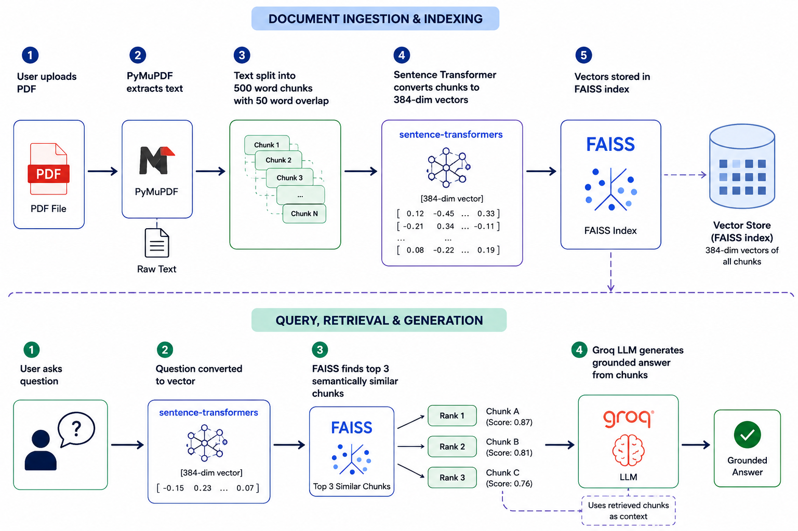

# RAG Application QnA

An end-to-end RAG system that allows users to upload any PDF document and ask natural language questions. The system retrieves semantically relevant content using FAISS and generates accurate grounded answers using Groq's LLM API.

---

## 🔴 Live Demo
👉 [Click here to open the live app]()


## Problem Statement 
Traditional keyword search fails to understand context and meaning. This system uses semantic search and LLM reasoning to provide accurate, context-aware answers grounded in your specific document.

---


## Features

- Semantic search using embeddings
- PyTorch based embedding generation
- Free LLM inference via Groq
- Clean Streamlit UI
- Modular OOP architecture
- Production grade error handling

---


## Tech Stack


| Category                            | Technology            |
| ----------------------------------- | --------------------- |
| PDF Processing                      | PyMuPDF               |
| Embedding Models                    | Sentence-Transformers |
| Vector Database / Similarity Search | FAISS (faiss-cpu)     |
| LLM Inference API                   | Groq                  |
| Environment Management              | python-dotenv         |


## Architecture 
1. User uploads PDF → PyMuPDF extracts text
2. Text split into 500 word chunks with 50 word overlap
3. Sentence Transformer converts chunks to 384-dim vectors
4. Vectors stored in FAISS index
5. User asks question → question converted to vector
6. FAISS finds top 3 semantically similar chunks
7. Groq LLM generates grounded answer from chunks

<h3>RAG Pipeline Architecture</h3>

<p align="center">
  
</p>

---

## 🚀 Installation

**1. Clone the repo**
```bash
git clone https://github.com/aman-verma02/Rag-Document-QnA.git
cd Rag-Document-QnA
```

**2. Create virtual environment**
```bash
python -m venv .venv
source .venv/bin/activate
pip install -r requirements.txt
```

**3. Set environment variables**
```bash
cp .env.example .env
# Add Groq Api Key
```

**4. Run Streamlit dashboard**
```bash
streamlit run app.py
```


## Project Structure

```bash
Rag-Document-QnA/
├── src/
│   ├── pipeline.py
│   ├── embeddings.py
│   ├── exceptions.py
│   ├── llm.py
│   ├── vector_store.py
│   ├── pdf_processor.py
├── streamlit/
│   └── config.toml                    
├── app.py                           # dashboard entry point
├── requirements.txt                 # dependencies
└── .gitignore             
└── README.md               
└── architecture.png          
└── .env.example              
```

## License
MIT License — feel free to use and modify.